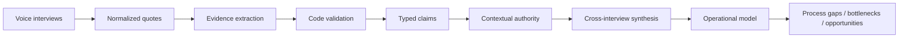

# Plexo Engineering

> How we turn messy human conversations into an evidence-backed model of how a company actually operates.

Plexo interviews people across a company and reconstructs processes, handoffs, bottlenecks, and the gap between **how work is supposed to happen** and **how it actually happens**.

The interesting engineering problem is not speech-to-text or prompting. It is making a probabilistic, multi-agent system produce operational conclusions that are **traceable, testable, and safe to disagree with**.

This repository is a sanitized technical deep dive into the architecture behind Plexo. It is intentionally not the production codebase and contains no customer data, credentials, internal prompts, or deployment configuration.

## The problem

Ask ten people how the same process works and you may get ten partially correct answers.

One person knows the official design. Another knows the workaround everyone actually uses. Someone remembers a metric but is unsure. Someone else repeats something they heard from another team. A manager and an operator can both be telling the truth while apparently contradicting each other.

A useful system cannot just summarize all of that text.

It needs to answer:

- **What exactly was claimed?**
- **What evidence supports it?**
- **How close is the source to the work?**
- **Is this intended design or observed reality?**
- **What happens when interviews disagree?**
- **How confident should the system actually be?**

## Architecture



The pipeline is deliberately multi-stage. Each stage produces typed artifacts that the next stage consumes.

**The core rule: LLMs propose; code validates.**

Read the full walkthrough in **[Architecture](docs/architecture.md)**.

## Three hard problems

### 1. Preventing the system from manufacturing evidence

A claim only enters the model if it can point to valid source evidence.

The production validator handles cases such as missing quotes, vague evidence, uncertain metrics, weak hearsay, and even **assent-only answers** where the interviewer introduced the substance and the participant merely said “yes, exactly.”

A small public version is here:

[`src/evidence-pipeline/claim-validation.ts`](src/evidence-pipeline/claim-validation.ts)

### 2. Knowing who is authoritative about what

Authority is contextual.

A Finance Manager might own invoicing, execute part of budgeting, and only observe logistics. Assigning one authority score to that person would contaminate every downstream conclusion.

Plexo derives authority at the participant/process/claim level using signals such as declared process role, seniority, proximity to work, and claim type.

See the sanitized implementation:

[`src/evidence-pipeline/authority.ts`](src/evidence-pipeline/authority.ts)

### 3. Preserving disagreement instead of averaging it away

Suppose a process owner says:

> Purchases above $5,000 are approved by Operations before Finance receives them.

But the analyst doing the work says:

> In practice I send the spreadsheet directly to Finance, and Operations reviews it afterward.

The wrong system picks one story or writes a vague average.

Plexo can preserve both as a **design ↔ reality conflict**, with provenance for each side.

Walk through the synthetic artifacts:

[`interview-input.json`](examples/interview-input.json) → [`extracted-claims.json`](examples/extracted-claims.json) → [`synthesized-output.json`](examples/synthesized-output.json)

## Reliability beyond the LLM

Voice systems add another failure surface: turn timing, silence, interruptions, pause/resume state, truncated answers, provider outages, and UI/audio synchronization.

The production project uses observable traces and deterministic voice evals for failure modes that should not be judged “by vibes.” It also has end-to-end evaluation across the interview and downstream pipeline.

Read **[Reliability](docs/reliability.md)** for the deeper breakdown.

## Design principles

| Principle | Why |
| --- | --- |
| **No evidence → no claim** | Prevent unsupported conclusions from entering the company model. |
| **Typed artifacts between agents** | Make every stage inspectable and independently testable. |
| **Intended ≠ actual** | Organizational contradictions often contain the most valuable information. |
| **Authority is contextual** | Job title alone does not tell you who knows a process. |
| **Deterministic gates around probabilistic models** | Put hard product invariants in code, not another prompt. |
| **Preserve uncertainty** | An unresolved conflict is safer than false certainty. |
| **Observable voice state** | Reliability requires traces, not anecdotes. |

## Repository map

```text
.
├── README.md
├── docs/
│   ├── architecture.md
│   └── reliability.md
├── examples/
│   ├── interview-input.json
│   ├── extracted-claims.json
│   └── synthesized-output.json
└── src/
    └── evidence-pipeline/
        ├── types.ts
        ├── claim-validation.ts
        └── authority.ts
```

## What I worked on

My role on Plexo spans product/system design, technical implementation, and GTM. On the engineering side, areas I have personally worked on include:

- debugging production voice-agent failures and restoring interviews under time pressure,
- designing a multi-provider fallback approach for the voice layer,
- shaping the evidence-backed process reconstruction architecture,
- working on the system decisions behind how interviews become structured operational knowledge.

I keep this repository focused on the technical decisions I can explain and defend rather than publishing a large production code dump.

## Why this matters

The long-term goal is larger than generating a process report.

If AI agents are eventually going to execute meaningful operational work, they first need a reliable representation of **how the company works, who owns what, where reality differs from design, and what evidence supports that model**.

Plexo is an attempt to build that layer.
