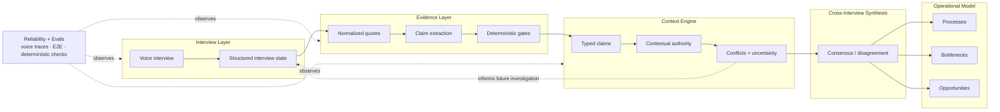

# Plexo — Engineering Deep Dive

> **Building a machine-readable model of how a company actually operates — from messy human conversations.**

**Plexo is the product. The production codebase is private. This repository is my public technical case study of the architecture, failures, reliability systems, and selected sanitized implementations behind it.**

Plexo interviews people across a company and reconstructs processes, handoffs, bottlenecks, ownership, and the gap between how work is supposed to happen and how it actually happens.

The interesting problem is not speech-to-text. It is not prompting. It is building a probabilistic system that can learn from many subjective sources without turning uncertainty into fake certainty.

## The real product is context

Voice is how Plexo collects operational knowledge today. Reports are one way we deliver it.

The durable technical asset sits in between: an **evolving operational context** that can retain evidence, provenance, confidence, contextual authority, and disagreement.

> **Context is not a prompt.** It is structured state that can be inspected, challenged, updated, and reused.

Instead of treating every interview as an isolated transcript, the system turns conversations into evidence-backed artifacts. New information can strengthen what we know, contradict it, extend the model, change who is authoritative for a specific process, or remain unresolved.



The feedback arrow matters more than the pipeline. The goal is not `interview → summary → report`. It is to build a representation that gets better as evidence accumulates.

> **Current production foundation:** quote-backed claims, deterministic evidence validation, contextual authority, multi-stage synthesis, conflict preservation, structured interview state, voice traces and E2E evaluation.  
> **Architectural direction:** increasingly use accumulated context, explicit unknowns and unresolved conflicts to decide what the system should investigate next.

## How context evolves

Suppose one manager says the intended purchase-approval process takes 20 minutes. An operator says the real process regularly takes two hours because approvals bounce between teams.

A naive system has three bad options: choose the manager, choose the operator, or average the answers.

Plexo's model can preserve both claims with their evidence and relationship to the process:

```text
Purchase approval
├── intended
│   └── "Manager approval should happen in ~20 min"
│       └── quote → interview → participant
│
└── observed
    └── "In practice it often takes ~2 h"
        └── quote → interview → participant

Result: disagreement preserved, not averaged away.
```

When new evidence arrives, the useful outcomes are:

| New evidence | Context behavior |
|---|---|
| Supports an existing claim | strengthen its evidence |
| Disagrees with a claim | preserve a conflict |
| Reveals something new | extend the model |
| Comes from a better source for that process | reconsider contextual authority |
| Is weak or ambiguous | retain uncertainty instead of manufacturing certainty |

See the synthetic end-to-end example in [`examples/context-update.json`](examples/context-update.json) and the deeper model in [`docs/context-engine.md`](docs/context-engine.md).

## Context has layers

The model is easier to reason about when context is not one giant blob:

```text
Raw evidence
    ↓
Atomic claims + provenance
    ↓
People · roles · processes · tools
    ↓
Relationships + contextual authority
    ↓
Conflicts + uncertainty
    ↓
Operational conclusions
```

A conclusion should be able to travel backwards:

`Conclusion → Claim → Quote → Interview → Participant`

That property is why we prefer claims over transcript summaries. A summary is convenient for reading; it is a weak primitive for a system that needs to update and defend what it believes.

## Hard engineering decisions

The stack is not the interesting part. These decisions are.

| Decision | Why | Trade-off |
|---|---|---|
| [Bounded stages, not one giant agent](docs/decisions/001-multi-agent-boundaries.md) | Different stages fail differently and need independent evaluation | More contracts and orchestration |
| [Claims, not summaries](docs/decisions/002-claims-not-summaries.md) | Preserve provenance and make knowledge composable | More structured state |
| [LLMs propose; code validates](docs/decisions/003-llm-proposes-code-validates.md) | Deterministic invariants should not depend on another probabilistic call | Some useful weak evidence gets rejected |
| [Authority is contextual](docs/decisions/004-contextual-authority.md) | Job title is not a reliable proxy for who knows how a process actually runs | Authority becomes process- and claim-dependent |
| [Contradictions are data](docs/decisions/005-preserve-conflicts.md) | Intended and observed reality can both matter | Downstream synthesis must reason over disagreement |
| [Structured, scoped context](docs/decisions/006-structured-scoped-context.md) | Context should be selected, not dumped into a prompt | Requires explicit context boundaries |
| [Unknowns are first-class](docs/decisions/007-unknowns-first-class.md) | What we do not know can determine what to investigate next | Architectural direction; requires careful state design |

## One rule that changed the architecture

### LLMs propose. Code validates.

An extraction model may propose a perfectly plausible operational claim that nobody actually supported.

So evidence invariants live outside the model where possible. The sanitized validator in [`src/evidence-pipeline/claim-validation.ts`](src/evidence-pipeline/claim-validation.ts) demonstrates the production principle: resolve quote IDs, reject unsupported claims, detect assent-only evidence, treat hearsay/uncertainty differently, and calibrate confidence.

```text
Transcript
   ↓
LLM proposes typed claims
   ↓
Deterministic evidence gates
   ↓
Accepted / rejected / confidence-adjusted claims
```

**No evidence → no accepted claim.**

## Things we got wrong

One of the best architecture changes came from measuring a bad assumption.

We initially leaned too heavily on **seniority as a proxy for process authority**. An internal comparison documented in the production code showed the heuristic agreeing with declared process ownership only about **66%** of the time in that sample, with the failure pattern concentrated in missing real owners.

The fix was not a better title mapping. We changed the model: authority is derived in the context of **participant × process × claim**, and declared process roles can override the weak seniority proxy.

That matters because perfect extraction with the wrong authority model still corrupts company context.

[Read the failure story →](docs/things-we-got-wrong.md)

## Voice reliability is a systems problem

A voice agent can produce great text and still fail as a product.

We built deterministic trace checks around failure modes that text-only evals miss:

- pause / resume that leaves a session muted,
- turn signals emitted before audio actually ends,
- truncated participant responses,
- missing required questions or checkpoints,
- timing/state-machine failures,
- provider failure and fallback behavior.

The point is not to ask an LLM whether an interview “felt good.” When a failure can be expressed as an invariant over a trace, we test the invariant.

[Read the reliability deep dive →](docs/reliability.md)

## Selected sanitized implementation

This is intentionally small. I would rather expose three readable ideas than dump a private production system into a public repository.

```text
src/evidence-pipeline/
├── types.ts              # quote, source and claim contracts
├── claim-validation.ts   # deterministic evidence gates
└── authority.ts          # process-aware authority derivation

examples/
├── interview-input.json
├── extracted-claims.json
├── synthesized-output.json
└── context-update.json
```

Start with [`claim-validation.ts`](src/evidence-pipeline/claim-validation.ts), then [`authority.ts`](src/evidence-pipeline/authority.ts).

## What I personally worked on

Plexo is a team project. These are areas I can personally defend in detail:

- **Production voice debugging.** During live client work, I traced a voice failure across VAD/turn behavior and a provider outage and helped restore the interview flow under time pressure.
- **Voice resilience.** I designed and implemented a fallback approach across multiple voice providers so one provider failure would not stop the interview operation.
- **Evidence-backed reconstruction.** I worked on the architecture that turns interviews into structured operational knowledge rather than treating transcripts as the final artifact.
- **Context as a system primitive.** I pushed the design toward typed evidence, provenance, contradictions and process-specific authority so downstream agents can reason over a defensible company model.

The most interesting parts of Plexo came from the places where the obvious implementation stopped working.

## Where this goes

The long-term problem is bigger than process mapping.

Before an AI agent can reliably execute work inside a company, it needs a trustworthy representation of:

- what the process actually is,
- who owns and executes each part,
- which rules and exceptions matter,
- where sources disagree,
- what is still unknown,
- and what evidence supports each conclusion.

That is the layer we are trying to build.

```text
Human knowledge → Evidence → Operational context → Decisions → Agents
                         ↑                         |
                         └────── new evidence ─────┘
```

---

### Go deeper

[`Context Engine`](docs/context-engine.md) · [`Architecture`](docs/architecture.md) · [`Decisions`](docs/decisions/001-multi-agent-boundaries.md) · [`Reliability`](docs/reliability.md) · [`Things we got wrong`](docs/things-we-got-wrong.md)

> This repository contains synthetic examples and sanitized technical material only. It contains no customer data, credentials, internal prompts, or deployment configuration.