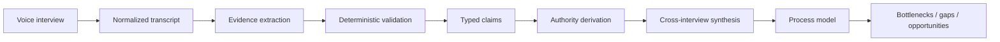

# Architecture

Plexo's core engineering problem is not transcription. It is turning many subjective conversations into a structured model of how a company actually operates without flattening disagreement or letting an LLM invent connective tissue.

The production system is larger than this public repository. This document describes the architectural principles behind it using sanitized examples.

## Pipeline

Each boundary produces a typed artifact. Downstream stages consume those artifacts instead of relying on an ever-growing chat transcript.

## 1. Voice interview → normalized transcript

The interview layer collects operational knowledge from people who perform, own, approve, or receive work. Raw conversation is normalized into stable quote IDs so later stages can point back to exact evidence.

That quote identity is important: a conclusion should remain auditable after several agent stages.

## 2. Evidence extraction

The extraction agent proposes atomic claims such as:

- how a process is intended to work,
- how it actually works,
- manual work,
- bottlenecks,
- handoffs,
- metrics,
- process ownership.

The key design choice is that the model proposes structured data; it does not get final authority over whether the evidence is admissible.

## 3. Deterministic validation

Before a proposed claim enters the operational model, code validates it.

Examples of checks used by the real system include:

- referenced quote IDs must exist,
- a claim cannot survive without direct evidence,
- assent-only answers such as “yes, exactly” are not treated as evidence for substance introduced by the interviewer,
- uncertain quantified claims can be rejected,
- hearsay from a source far from the work is treated differently from a specific first-hand example,
- vague evidence caps confidence.

A simplified public version is in [`src/evidence-pipeline/claim-validation.ts`](../src/evidence-pipeline/claim-validation.ts).

This split gives us a useful rule:

> **LLMs propose. Code validates.**

## 4. Authority is contextual

A participant should not receive one global authority score.

The same person may own invoicing, execute purchasing, and only observe logistics. Authority therefore needs to be derived at the **participant × process × claim** level.

Plexo combines signals such as declared process role, seniority, proximity to the work, and the type of claim being made. A simplified example is in [`src/evidence-pipeline/authority.ts`](../src/evidence-pipeline/authority.ts).

## 5. Intended process ≠ operational reality

This is one of the most important distinctions in the system.

A manager might accurately describe the approved process while an operator accurately describes what happens every day. Those statements are not necessarily mutually exclusive; they can expose a design-vs-reality gap.

Plexo keeps these evidence classes separate through extraction and synthesis so disagreement can become an explicit artifact instead of being averaged away.

See the synthetic example:

- [`interview-input.json`](../examples/interview-input.json)
- [`extracted-claims.json`](../examples/extracted-claims.json)
- [`synthesized-output.json`](../examples/synthesized-output.json)

## 6. Cross-interview synthesis

Only after claims have evidence and source metadata does synthesis reason across interviews.

The synthesis layer can ask questions such as:

- Do multiple operators describe the same workaround?
- Does the intended process differ from observed execution?
- Is a bottleneck supported by first-hand evidence or repeated hearsay?
- Are two names actually referring to the same process or tool?
- Which claims should remain unresolved because evidence conflicts?

The output is a structured operational model that can support process maps, bottleneck analysis, opportunity discovery, and eventually agent execution.

## Why not one giant agent?

A single model call is simpler to demo but harder to trust.

Splitting the system into stages gives us:

1. **Auditability** — conclusions retain links to source evidence.
2. **Testability** — extraction, validation, authority, and synthesis can fail independently and be evaluated independently.
3. **Determinism where it matters** — schema checks and evidence gates do not depend on another probabilistic judgment.
4. **Better failure analysis** — we can distinguish bad interviewing from bad extraction from bad synthesis.
5. **Safer iteration** — changing one agent does not require rewriting the entire reasoning chain.

The result is less magical than an opaque end-to-end prompt, and deliberately so. For operational intelligence, being able to explain *why the system believes something* is part of the product.
