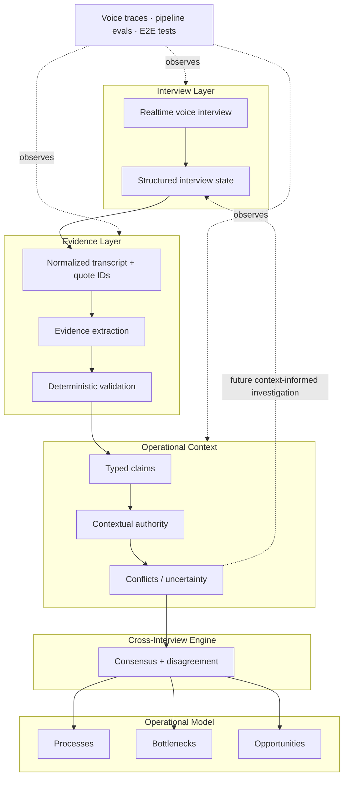

# Plexo Architecture

Plexo turns many subjective conversations into an evidence-backed operational model. The architecture is deliberately staged because interviewing, extraction, evidence checking, reconciliation and reporting have different failure modes.

The important architectural shift is to stop thinking of this as a one-way `transcript → report` pipeline. Structured artifacts let later evidence feed back into the operational context.

## System view



The solid path represents the production-backed flow. The feedback arrow represents the direction we are building toward: accumulated context should increasingly determine what is worth asking or verifying next.

## 1. Interview layer

The interview is not just audio collection. Plexo maintains structured state during the conversation so the system can track progress through the interview rather than relying only on a final transcript.

Voice introduces its own state-machine failures: interruption, silence, pause/resume, premature turn-taking, truncated responses and provider outages. Those failures are evaluated separately from semantic answer quality.

## 2. Normalized evidence

The transcript is normalized into evidence with stable quote references. This creates an addressable evidence layer for downstream extraction.

The boundary matters: downstream claims refer to quotes instead of copying or paraphrasing evidence with no provenance.

## 3. Extraction proposes claims

An LLM proposes typed operational claims such as:

- actual process,
- intended process,
- bottleneck,
- manual work,
- handoff,
- metric,
- process ownership.

The extraction layer is explicitly instructed to treat transcript content as data, not instructions. But prompt instructions alone are not considered a sufficient reliability boundary.

## 4. Deterministic evidence validation

Code validates structural/evidence invariants after extraction.

Examples include:

- referenced quote IDs must exist,
- process-owner claims need process identity,
- assent-only answers are not treated as substantive evidence,
- uncertainty and hearsay affect admissibility/confidence,
- distant weak sources should not become strong claims about observed reality.

This is the core principle:

> **LLMs propose; code validates.**

See [`../src/evidence-pipeline/claim-validation.ts`](../src/evidence-pipeline/claim-validation.ts).

## 5. Contextual authority

There is no single global `authorityScore(person)`.

Someone may know the intended policy because they own a process while an operator is the better source for what actually happens every day.

The useful abstraction is closer to:

```text
authority(participant, process, claim relationship)
```

The production logic combines process context, intended-vs-reality relationship and declared process role. This replaced an earlier over-reliance on seniority.

See [`../src/evidence-pipeline/authority.ts`](../src/evidence-pipeline/authority.ts) and [`things-we-got-wrong.md`](things-we-got-wrong.md).

## 6. Cross-interview synthesis

Once claims have evidence and authority metadata, synthesis can compare interviews without pretending every statement has equal epistemic weight.

The system can preserve:

- agreement,
- intended vs observed divergence,
- source disagreement,
- uncertainty that should not be collapsed into a confident conclusion.

Contradiction is often the finding.

## 7. Operational artifacts

Downstream analysis and reports are built from structured artifacts rather than directly from raw transcripts. This makes the boundaries inspectable and gives us places to reject or evaluate bad intermediate outputs.

The report is therefore a projection of the operational model, not the model itself.

## Why not one giant agent?

A single large agent is attractive because orchestration is simpler. It is also difficult to inspect.

If one call interviews, extracts, resolves contradictions, assigns authority, ranks bottlenecks and writes prose, a wrong conclusion has no useful fault boundary.

With bounded stages we can ask:

```text
Was the quote wrong?
Was the claim unsupported?
Was confidence miscalibrated?
Was the wrong source treated as authoritative?
Was synthesis wrong despite valid inputs?
Was the final presentation wrong?
```

That is more code and more contracts. The trade-off is worth it because failures become localizable and evaluable.

## Current system vs next architecture

### Production-backed

- structured interview state,
- quote-addressable evidence,
- typed claim extraction,
- deterministic evidence validation,
- process/claim-aware authority,
- cross-interview synthesis,
- preservation of intended-vs-observed disagreement,
- structured downstream artifacts,
- voice traces, pipeline evals and E2E testing.

### Architectural direction

- explicit unknowns as durable state,
- task-scoped context views,
- accumulated context selecting the next best question/investigation,
- operational outcomes feeding back into the company model.

The distinction is intentional. This repository is meant to show engineering reasoning, not pretend future work is already shipped.

## Deeper reading

- [`context-engine.md`](context-engine.md) — how we think about evolving company context
- [`reliability.md`](reliability.md) — evidence and voice reliability
- [`decisions/`](decisions/001-multi-agent-boundaries.md) — architecture decisions and trade-offs
- [`things-we-got-wrong.md`](things-we-got-wrong.md) — measured failures that changed the design